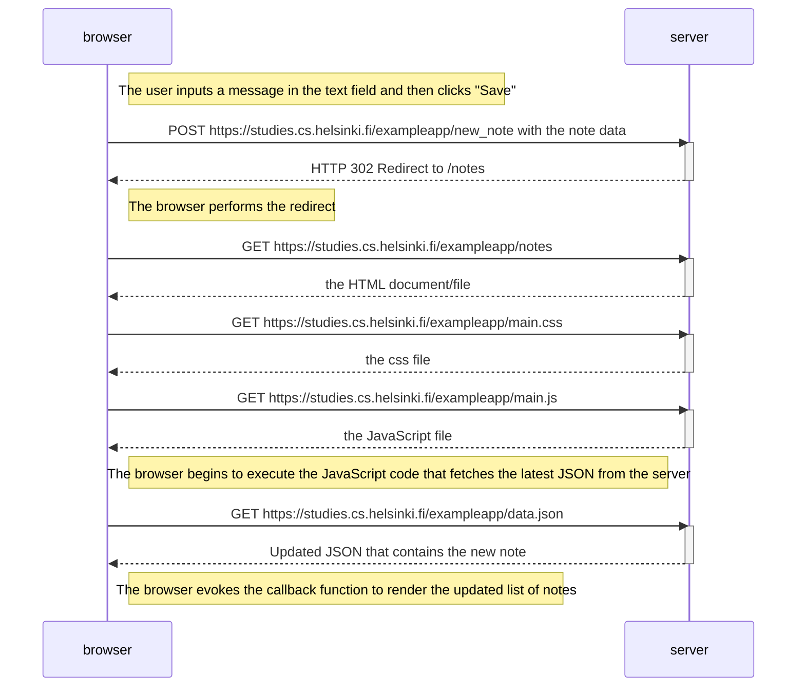

```mermaid
sequenceDiagram
    participant browser
    participant server

    Note right of browser: The user inputs a message in the text field and then clicks "Save"

    browser->>server: POST https://studies.cs.helsinki.fi/exampleapp/new_note with the note data
    activate server
    server-->>browser: HTTP 302 Redirect to /notes
    deactivate server

    Note right of browser: The browser performs the redirect

    browser->>server: GET https://studies.cs.helsinki.fi/exampleapp/notes
    activate server
    server-->>browser:the HTML document/file
    deactivate server

    browser->>server: GET https://studies.cs.helsinki.fi/exampleapp/main.css
    activate server
    server-->>browser: the css file
    deactivate server

    browser->>server: GET https://studies.cs.helsinki.fi/exampleapp/main.js
    activate server
    server-->>browser: the JavaScript file
    deactivate server

    Note right of browser: The browser begins to execute the JavaScript code that fetches the latest JSON from the server

    browser->>server: GET https://studies.cs.helsinki.fi/exampleapp/data.json
    activate server
    server-->>browser: Updated JSON that contains the new note
    deactivate server

    Note right of browser: The browser evokes the callback function to render the updated list of notes
```
