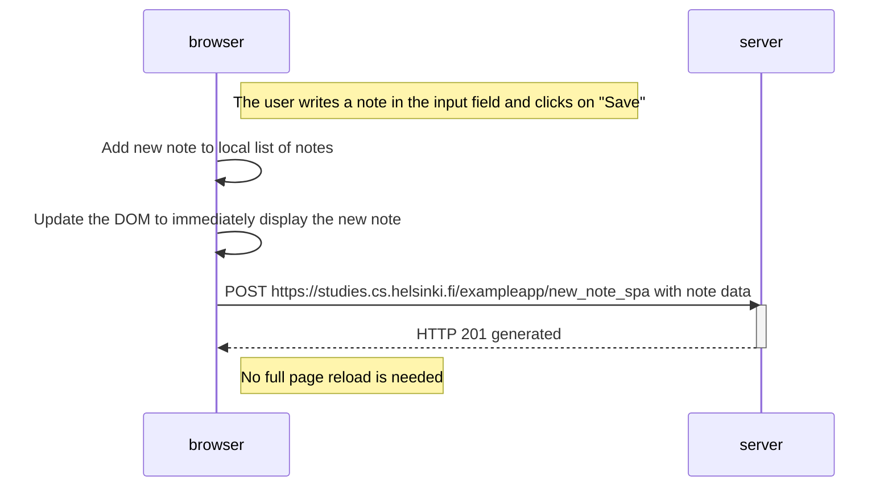

```mermaid
sequenceDiagram
    participant browser
    participant server

    Note right of browser: The user writes a note in the input field and clicks on "Save"

    browser->>browser: Add new note to local list of notes
    browser->>browser: Update the DOM to immediately display the new note

    browser->>server: POST https://studies.cs.helsinki.fi/exampleapp/new_note_spa with note data
    activate server
    server-->>browser: HTTP 201 generated
    deactivate server

    Note right of browser: No full page reload is needed
```
